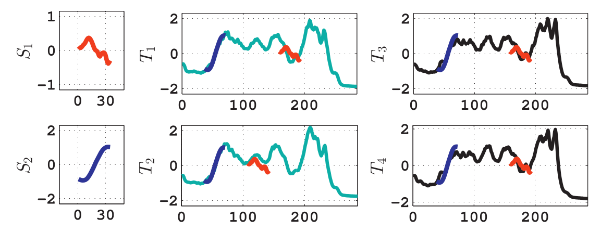

# pytorch_SSSL
---

# A PyTorch implementation of the Semi-Supervised Shapelet Learning (SSSL) algorithm, defined in the research paper by Wang et al. (2019).

__Note: This is still a Work in Progress__

## Introduction

__Time Series Classification (TSC)__ involves building predictive models for a discrete target variable (class) from ordered, real valued, attributes (time series). Existing TSC algorithms can be generally categorized into two groups: distance-based methods and feature-based methods. The former directly measures the similarity between two time series -e.g., dynamic time warping, DTW, Keogh, and Ratanamahatana (2005)-, while the later considers time series as feature vectors so that a traditional feature-based classifier -e.g., SVM or logistic regression- can be applied. Feature-based methods rely on extracting or learning a set of feature vectors from each time series. Thus, the main challenge for (feature-based) TSC is to discover explainable and discriminative features that can best classify instances of time series in a data set.

Over the last 10 years, a series of research work in TSC has been proposed to explore the concept of __shapelets__, which represent maximally discriminative segments or subsequences of time series data. The concept of shapelet and its application to TSC was first proposed in the pioneer work of Ye & Keogh (2009), as an innovative supervised motif discovery algorithm, where univariate shapelets are searched within a time-series exhaustively among all possible candidates (subsequences) using a decision-tree-like approach. Shapelets are time series subsequences which are in some sense maximally representative of a class and enjoy the merits of high prediction capability and interpretability. Since shapelets represent local patterns of time series that can be used to classify them into a set of classes, a classification decision can be directly made by the presence or absence of particular shapelets (or, in a more generic way, by a Shapelet Transform operation, which translates the original time series into a new representation, for example by computing the distance of the time series to each of the shapelets in a given set). Therefore, shapelets can capture inherent structures of time series, contributing to high prediction accuracy as explainable features. Classifiers which use shapelets take the similarity between the time series and the shapelets as features, and have been proven to achieve a performance competitive to state-of-the-art classification methods, while enhancing the model’s interpretability.

The figure below shows two shapelets S1 and S2, extracted from the Coffee data set, available in UCR time-series repository (Dau et al., 2018).

In their original formulation, shapelet-based methods were based on the enumeration (or random search) of potential candidates (subsequences) and can therefore be categorized as __shapelet discovery__ algorithms, in the sense that shapelets are looked for among subsequences of the entire possible subsequence space of the training data, and their quality is evaluated according to target prediction qualities, measured by a defined criterion (e.g. information gain in tree-based approaches). Within this category, each shapelet is constrained to be a subsequence of existing data. However, shapelet discovery methods are not scalable to large data sets. As an alternative to this shapelet discovery approach, and instead of restricting the shapelets to subsequences of the raw time series, Grabocka et al (2014) proposed to directly learn, from scratch, the true shapelets rather than searching from all the problem space, in what is known as __shapelet learning__. Since shapelets are learned and updated by the model, they are not constrained to be subsequences of the training data. Compared with traditional approaches of shapelet discovery, the main merit of shapelet learning is that it learns near-to-optimal shapelets directly, avoiding an exhaustive search among a pool of candidates extracted from time series segments. Shapelet learning is fast to compute and scalable to large data sets, and it is robust to noise. 

Finally, creating a large set of training data can be prohibitively expensive, time-consuming or even infeasible. Although it would be highly desirable to have abundant amounts of labeled time series, this is not usually the case, and therefore we need a solution that can use a small labeled training set, together with a large unlabeled training set, to effectively learn discriminative shapelets in time series classification problems. Learning from both labeled and unlabeled data is called __semi-supervised learning (SSL)__. The most natural approach for SSL is self-training, in which a classifier is first trained with a small number of labeled data and then it is used to classify the unlabeled data. By adding the
most confidently classified objects into the labeled set, the classifier re-trains itself using the new labeled set. The procedure is repeated until adding newly labeled objects to the labeled set does not increase the accuracy of the classifier, or some other stopping criteria is met. Several SSSL methods for time series classification have been proposed in the literature. However, most of these are kernel-based methods, such as time series distance methods and probabilistic methods. Because time series are potentially infinite, kernel-based methods often cannot identify which segments of time series are mostly discriminative for distinguishing between time series data from different classes.

## Semi-Supervised Shapelet Learning (SSSL)

In their 2019 [paper](https://www.sciencedirect.com/science/article/pii/S0031320318304473), Wang et al. (2019) introduced a new Semi-Supervised Shapelet Learning (SSSL for short) algorithm to efficiently learn shapelets by using both labeled and unlabeled time series data. Briefly, SSSL engages both labeled and unlabeled time series data in an integrated model that considers least squares regression, pseudo-labels, shapelet regularization, and spectral analysis. The proposed optimization function treats unlabeled samples in a supervised fashion by using pseudo-labels, and then uses a regularized least-square technique to learn both shapelets and classification boundaries. Meanwhile, spectral analysis is integrated in the function to preserve local structure information in the data. Moreover, a new regularization term is added to avoid selecting similar or redundant shapelets. A coordinate descent algorithm is then proposed to iteratively solve the classification boundary, pseudo-labels and shapelets, respectively.

## References

Dau, H. A., Keogh, E., Kamgar, K., Yeh, C. M., Michael, Zhu, Y., Gharghabi, S., Ratanamahatana, C. A., Yanping, Hu, B., Begum, N., Bagnall, A., Mueen, A., Batista, G., and Hexagon-ML (2018). [The UCR Time Series Classification Archive](https://www.cs.ucr.edu/%7Eeamonn/time_series_data_2018/). October 2018.

Grabocka, J., Schilling, N., Wistuba, M., and Schmidt-Thieme. L. (2014). Learning Time-Series Shapelets. Proceedings of the 20th ACM SIGKDD international conference on Knowledge discovery and data mining, pp. 392–401.

Keogh, E., and Ratanamahatana, C.A. (2005). Exact indexing of dynamic time warping, Knowl. Inf. Syst. 7(3) (2005) pp. 358–386.

Wang, H., Qin, Z., Wu, J., Panf, S., and Chene, Y. (2019). Time series feature learning with labeled and unlabeled data, Pattern Recognition 89 (2019) 55–66.

Ye, L., and Keogh, E., (2009), Time series shapelets: A new primitive for data mining, SIGKDD, pp. 947–956.

